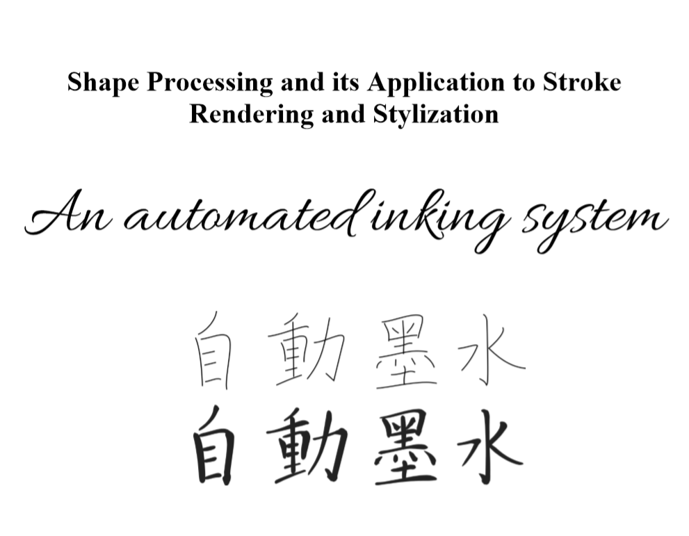
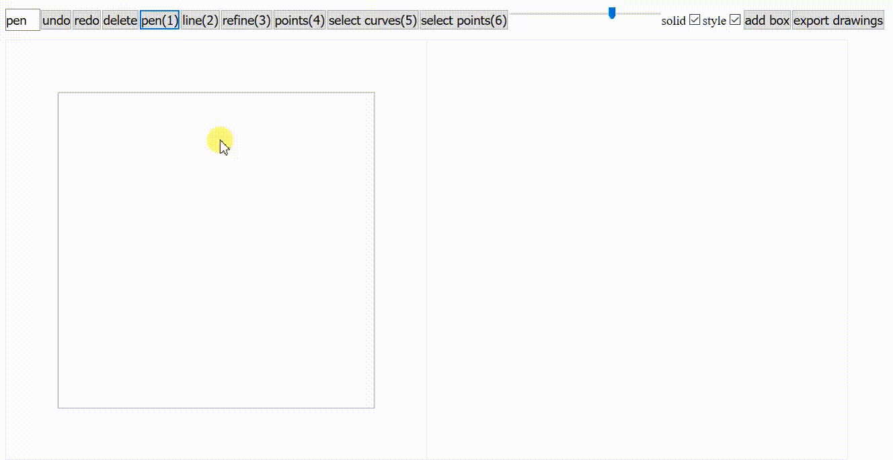

# An Automated Inking System

## Shape Processing and its Application to Stroke Rendering and Stylization

This is a brain dump of my final year project (commonly known as FYP) at HKUST. Basically, it is a system that allows you to input plain curves and turn it into stroked plausible inkings. The intended application including Chinese calligraphic font generation and animated cartoon.

### Automated dynamic inking for animation

### Interactive Chinese calligraphy

### Some HTML demo you may find interesting

#### Chinese Calligraphy
[stroke deform](https://tyt2y3.github.io/auto_ink/stroke_deform.html) 
[stroke library of Chinese calligraphy](https://tyt2y3.github.io/auto_ink/library%20of%20chin%20cali%202.html) 
[stylization of Chinese characters](https://tyt2y3.github.io/auto_ink/library_matching.html) 
[stage 1 of stylization](https://tyt2y3.github.io/auto_ink/library_matching.html?mode=present&stage=1) 
[stage 2 of stylization](https://tyt2y3.github.io/auto_ink/library_matching.html?mode=present&stage=2) 
[Chinese calligraphy pad](https://tyt2y3.github.io/auto_ink/sketch.html) 

#### Cartoon illustration
[stroke library of cartoon](https://tyt2y3.github.io/auto_ink/library%20of%20cartoon.html) 
[stylization of cartoon](https://tyt2y3.github.io/auto_ink/library_matching.html?mode=cartoon) 
[animation showing dynamic stroke interpolation](https://tyt2y3.github.io/auto_ink/animation.html) 

#### Shape
[shape decomposition](https://tyt2y3.github.io/auto_ink/shape_processing.html) 

### Technical details
[abstract](promotion%20booklet.pdf)
[slides](FYP%20presentation.pdf)
[full report](hftsangab_PSAN2_Final.pdf)

DISCLAIMER: this repository is all rights reserved, and is merely a "brain dump". You can only use it for academic research purpose. Albeit, the programs provided here are purely for demonstration purpose, and is so poorly implemented that it probably cannot handle practical inputs.